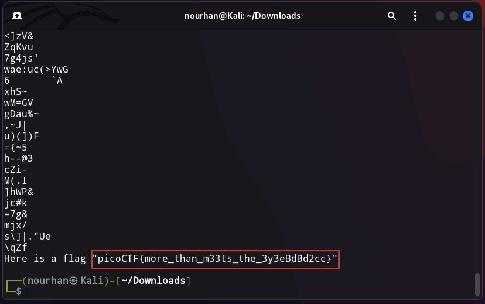

<a href="https://play.picoctf.org/practice/challenge/44?category=4&page=1"><h1> Glory of The Garden</h1></a>
<h3> The challenge is giving you an image to search in it </h3>

After i used the `exiftool` to see the metadata of image and didn't find any thing hidden.
I used the `strings` tool for the image , Most commercial and open source forensic tools allow for string searches and will search the allocated, unallocated, and file slack spaces.

As we see the flag was hidden in the strings of the image.

