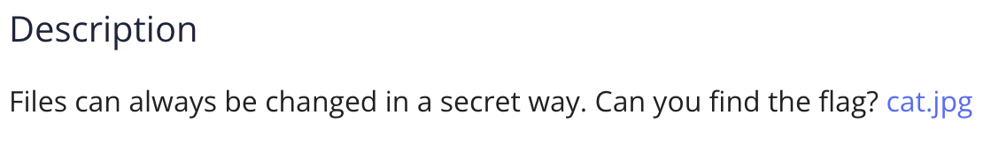
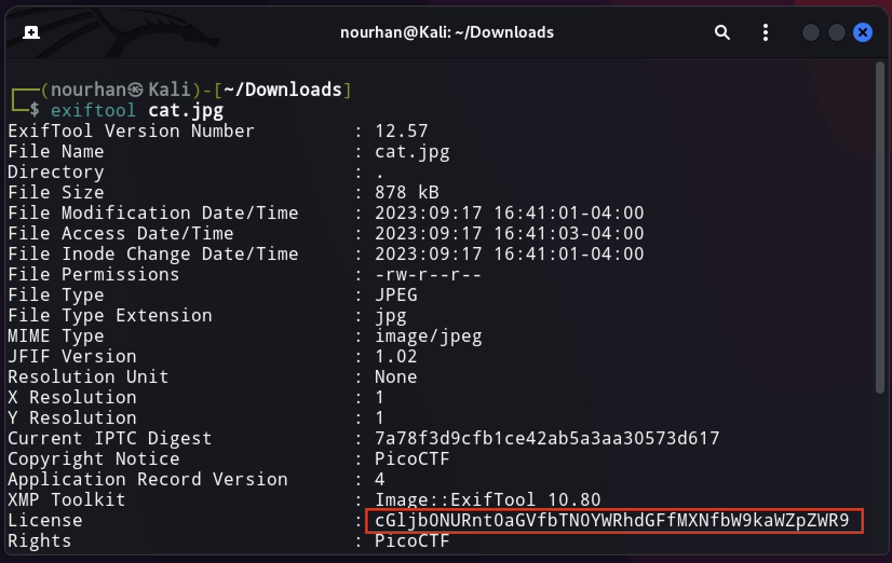
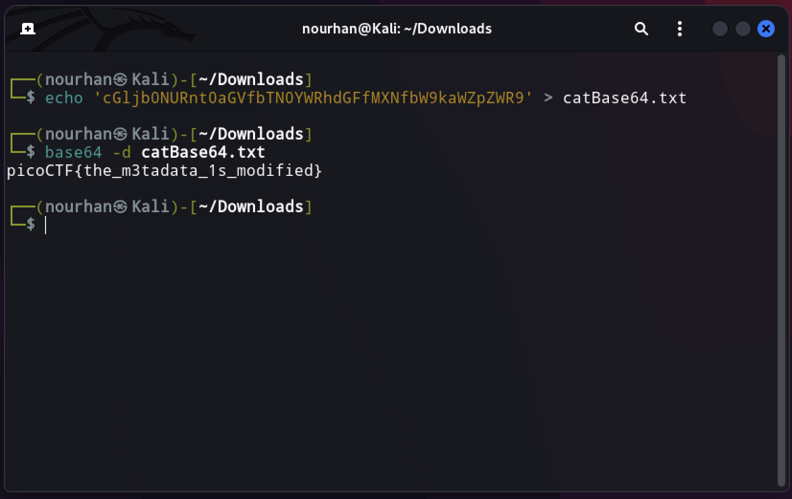

<a href='https://play.picoctf.org/practice/challenge/186?category=4&page=1&solved=0'><h1>  Infromation Challenge </h1><a>

<h3> The challenge is giving you an image and stating that there may be a hidden file in it </h3>

First thing I will use `exiftool`, this is a pre-installed tool on kali that provide you with the metadata of a file/image.

I found that there is a base64 code in the image's metadata.

 

I will take the base64 code into a text file to decode it.

A you see we found the flag there. 

` flag : picoCTF{the_m3tadata_1s_modified} `

