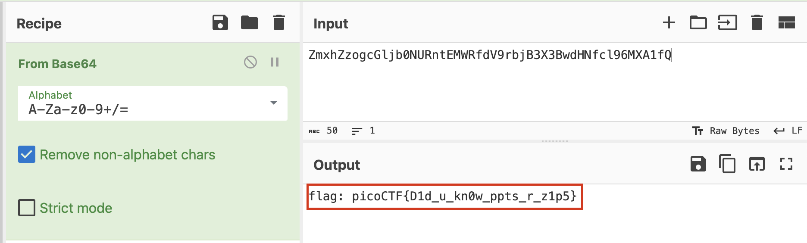

<a href="https://play.picoctf.org/practice/challenge/130?category=4&page=1"><h1> MacroHard WeakEdge </h1><a>

<h3> The challenge is giving you powerpoint file to investigate it </h3>


First I used `strings` tool to see the content of the file.
I saw a very strange path that contains `hidden` file in it.


So I extracted the file to go to the following path `ppt/masterSlides/hidden` 
I used the `cat` command to mirror the content of this text file.


I found strange strings that seems unreadable, i think it needs to be decoded.
Let's remove the spaces in the string using a simple python script :


```python
hidden = "Z m x h Z z o g c G l j b 0 N U R n t E M W R f d V 9 r b j B 3 X 3 B w d H N f c l 9 6 M X A 1 f Q"
hidden = hidden.split(" ")
print("".join(hidden))
```

The output returned is : ` ZmxhZzogcGljb0NURntEMWRfdV9rbjB3X3BwdHNfcl96MXA1fQ ` 
Let's decode it using <a href="https://gchq.github.io/CyberChef/">cyber chef</a>.



