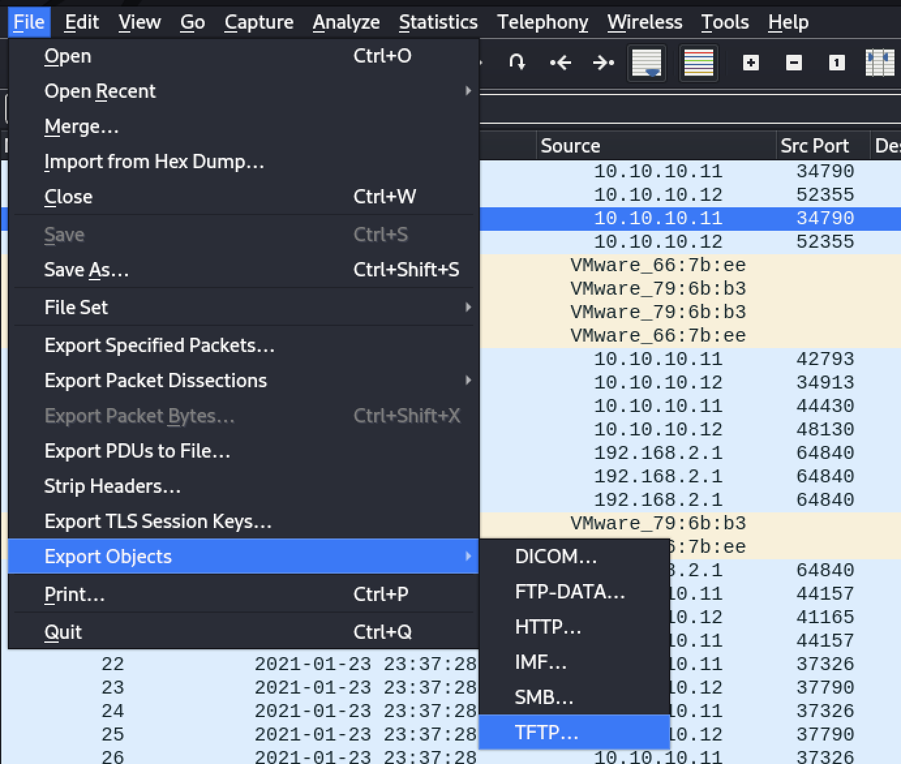
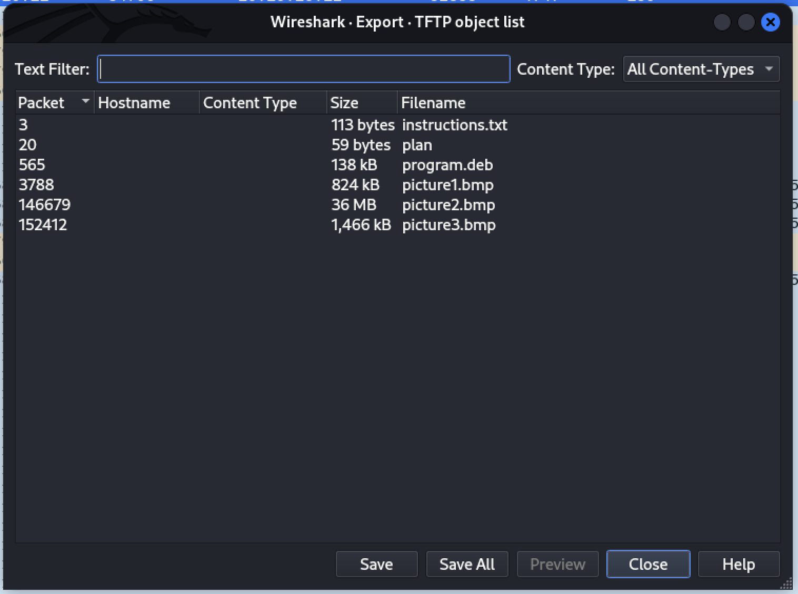
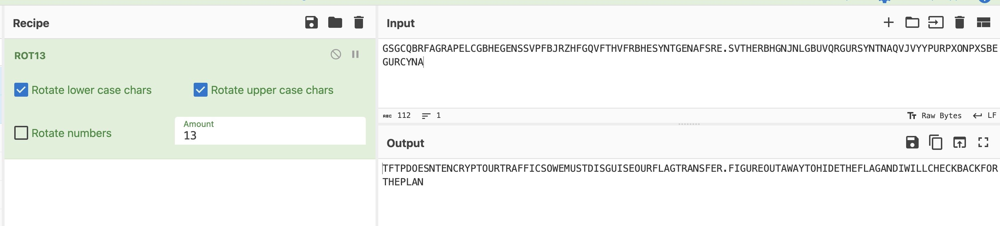
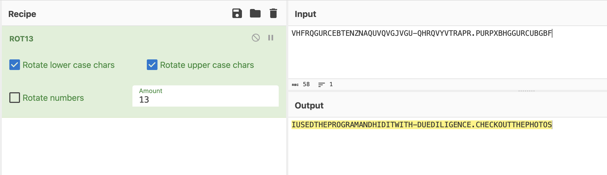
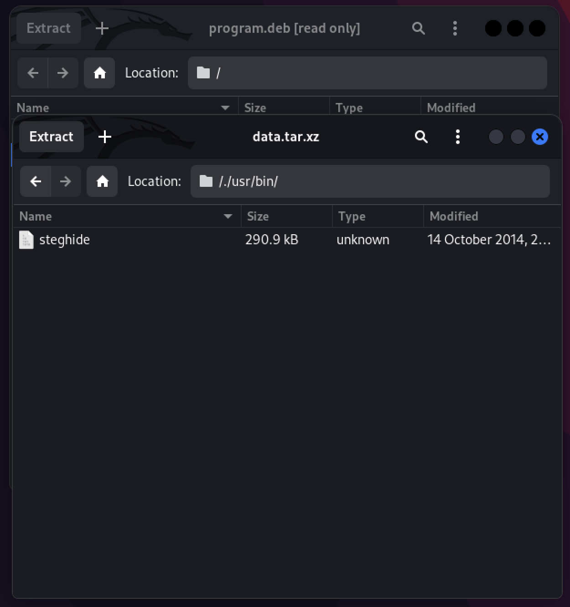
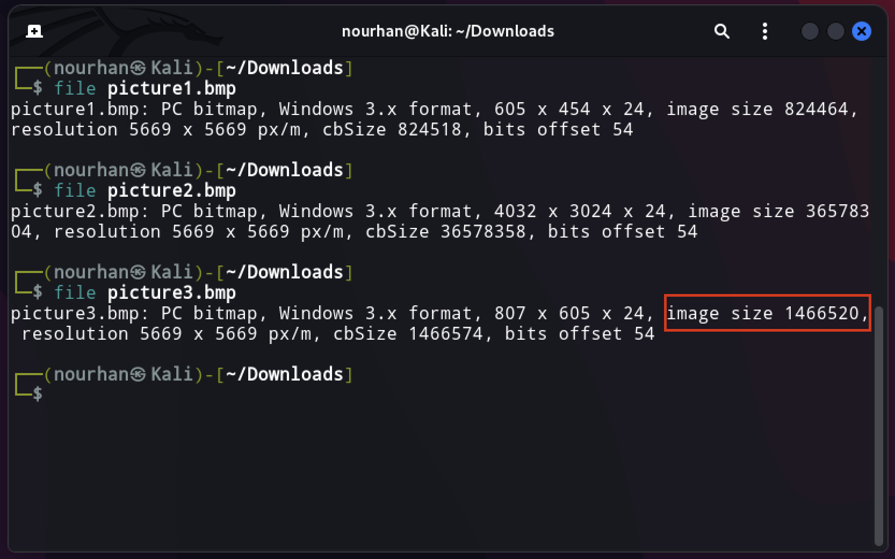
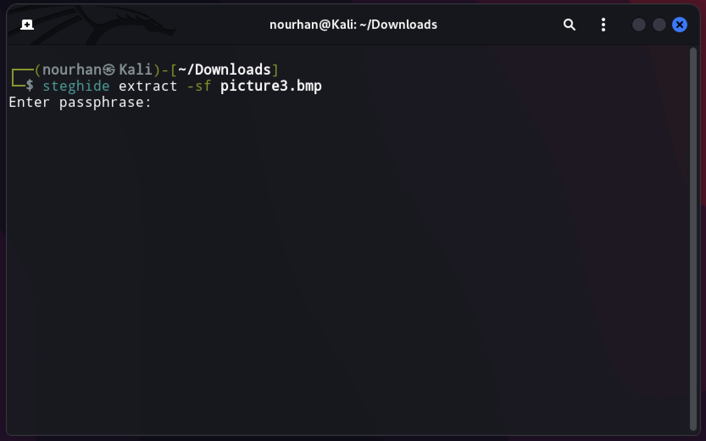
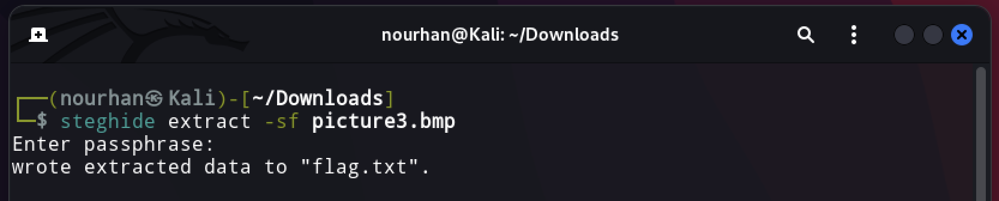

<a href="https://play.picoctf.org/practice/challenge/103?category=4&page=1"><h1>Trivial Flag Transfer Protocol</h1></a>

<h3>The challenge is giving a pcap file to search in it for the flag</h3>

The pcap file has a lot of packets so I will export only the files of the TFTP packets.

I found those files: **instruction.txt, plan, program.deb, picture1.bmp, picture2.bmp, and picture3.bmp.** Let's analyze each of them individually.

By reading the instruction.txt file, I think it contains encrypted values :

` GSGCQBRFAGRAPELCGBHEGENSSVPFBJRZHFGQVFTHVFRBHESYNTGENAFSRE.SVTHERBHGNJNLGBUVQRGURSYNTNAQVJVYYPURPXONPXSBEGURCYNA `

So let's try to decode it using cyberchef. Okay they are decrypted with ROT13.

The value is :

` TFTP DOESNT ENCRYPT OUR TRAFFIC SO WE MUST DISGUISE OUR FLAG TRANSFER. FIGURE OUT A WAY TO HIDE THE FLAG AND I WILL CHECK BACK FOR THE PLAN. `

I think it is a hint to check the plan file.

That was the content of the plan file:

` VHFRQGURCEBTENZNAQUVQVGJVGU-QHRQVYVTRAPR.PURPXBHGGURCUBGBF ` 

Let's use cyberchef to decode it:

The value is :
` I USED THE PROGRAM AND HID IT WITH - DUEDILIGENCE . CHECK OUT THE PHOTOS ` 

It is another hint to check the program and the photos.

When I opened the program I found many files that point to steghide. So I think that he used steghide to hide data inside the images.

I discovered the three images, and I found that picture3.bmp has the largest size so he may be hiding the data inside it.

Let's try to use steghide to extract data from it.

Hmmm It requires password to open it.

When I read the content of the plan file I didn't get ` WITH - DUEDILIGENCE ` . So let's try to use ` DUEDILIGENCE ` as our password.

Great! It worked!
Let's read flag.txt

Congratulations! 
`picoCTF{h1dd3n_1n_pLa1n_51GHT_18375919}`

