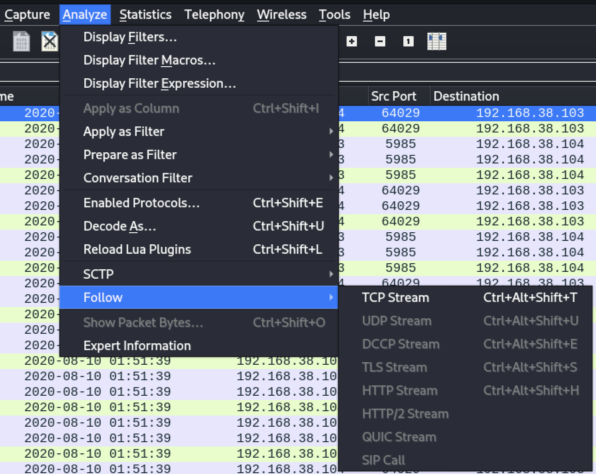
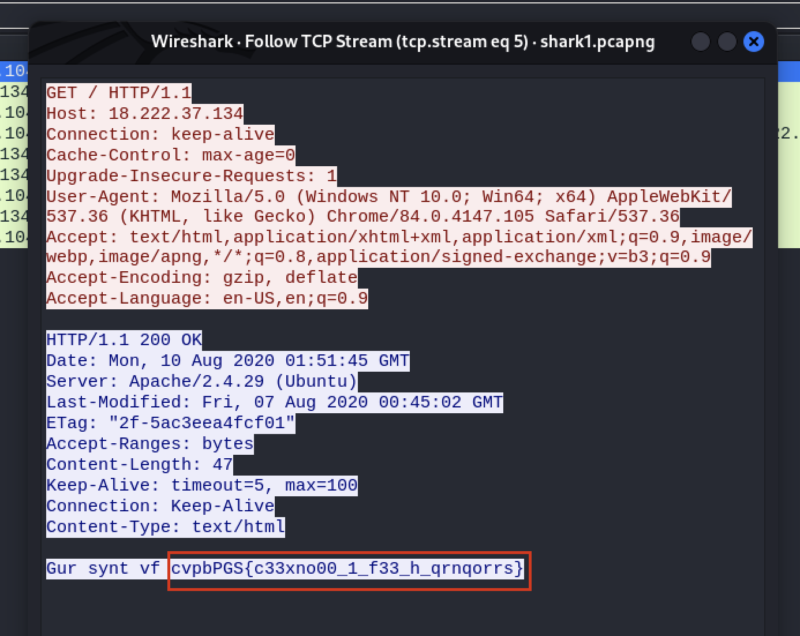
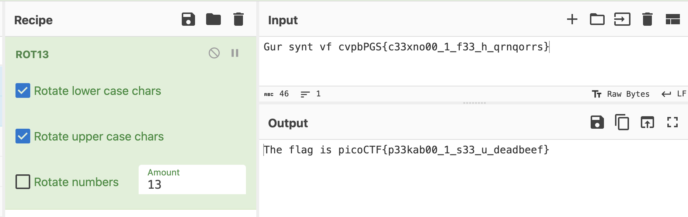

<a href="https://play.picoctf.org/practice/challenge/115?category=4&page=1"> <h1>Wireshark doo dooo do doo...</h1></a>

<h3>The challenge is giving a pcap file to serch in it for the flag</h3>

Use `wireshark` to investigate in this file.

I will follow all the tcp streams until I found a strange thing.

I found a suspicious line in stream number 5 that looks like the same format of the flag.

using <a href="https://gchq.github.io/CyberChef/">cyber chef</a>, I decoded this line usinf `ROT13`.
and here's the flag.

