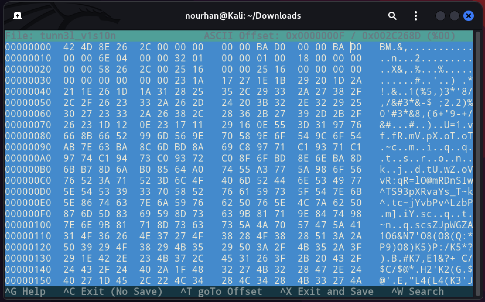

<a href="https://play.picoctf.org/practice/challenge/112?category=4&page=1&solved=0"><h1>tunn3l v1s10n</h1></a>

<h3> The challenge is giving you a file with no type and we can not open it</h3>

First I tried to open the file but it seemed that it has no extenstion, so i used `exiftool` to find his type.
We can see that the file is `bmp`. 

Now we can check if the file header is correct using any hex editor.

As we can see the file header is not bmp so we can change it to bmp file header.

The number of bytes in the DIB header are wrong and the number of bits per pixel are also wrong we realize we need to edit the bytes at offset 0x0e and 0x1c. 

So we will change the `ba d0` of the DIB header num-bytes to `28 00` and changing the `32 01` of the number of bits per pixel to `40 03`. Renaming the `tunn3lv1s10n` file to `tunn3lv1s10n.bmp` we are able to open it and get the flag.

